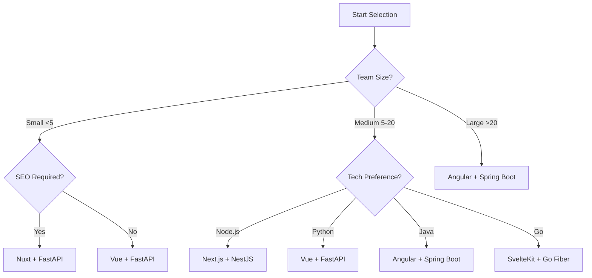

# Architecture Combination Guide

The core advantage of HaloLight lies in **complete frontend-backend decoupling**, supporting any combination. This document helps you choose the most suitable tech stack combination.

## 🎯 Quick Decision Flowchart



## 📊 Combination Evaluation Matrix

Rating mainstream combinations across dimensions (max ⭐⭐⭐⭐⭐):

### Next.js + NestJS

| Dimension | Rating | Description |
|-----------|--------|-------------|
| Development Efficiency | ⭐⭐⭐⭐⭐ | TypeScript full-stack unification, type sharing |
| Performance | ⭐⭐⭐⭐ | SSR + edge caching optimization |
| Learning Curve | ⭐⭐⭐ | Need to understand React and NestJS architecture |
| Ecosystem Maturity | ⭐⭐⭐⭐⭐ | npm ecosystem extremely rich |
| Deployment | ⭐⭐⭐⭐ | Vercel + Railway/Fly.io one-click deploy |
| **Overall** | **⭐⭐⭐⭐** | First choice for multi-tenant SaaS, enterprise backends |

### Vue + FastAPI

| Dimension | Rating | Description |
|-----------|--------|-------------|
| Development Efficiency | ⭐⭐⭐⭐⭐ | Vue smooth learning curve, FastAPI fast dev |
| Performance | ⭐⭐⭐⭐ | Vue 3 compilation optimized, Python async efficient |
| Learning Curve | ⭐⭐⭐⭐⭐ | Both relatively easy to pick up |
| Data Processing | ⭐⭐⭐⭐⭐ | Python data science ecosystem unbeatable |
| Deployment | ⭐⭐⭐⭐ | Frontend CDN, backend containerized |
| **Overall** | **⭐⭐⭐⭐⭐** | First choice for data/AI-driven apps |

### Angular + Spring Boot

| Dimension | Rating | Description |
|-----------|--------|-------------|
| Development Efficiency | ⭐⭐⭐ | Rigorous architecture, high initial investment |
| Performance | ⭐⭐⭐⭐ | Enterprise optimization mature |
| Learning Curve | ⭐⭐ | Both have some complexity |
| Enterprise Maturity | ⭐⭐⭐⭐⭐ | Large enterprise first choice |
| Long-term Maintenance | ⭐⭐⭐⭐⭐ | Clear architecture, highly maintainable |
| **Overall** | **⭐⭐⭐⭐** | Best for large enterprises, long-term projects |

### SvelteKit + Go Fiber

| Dimension | Rating | Description |
|-----------|--------|-------------|
| Development Efficiency | ⭐⭐⭐⭐ | Concise code, great dev experience |
| Performance | ⭐⭐⭐⭐⭐ | Both are performance benchmarks |
| Learning Curve | ⭐⭐⭐ | Svelte unique syntax, need to learn Go |
| Resource Usage | ⭐⭐⭐⭐⭐ | Extremely low memory and CPU usage |
| Deployment | ⭐⭐⭐⭐⭐ | Tiny container images, edge deployment ready |
| **Overall** | **⭐⭐⭐⭐⭐** | Best for high-performance real-time apps |

## 🎨 Combination Matrix

Below shows all possible frontend-backend combinations. Each cell represents a viable tech stack pairing.

### Frontend Frameworks (Horizontal) × Backend APIs (Vertical)

| Frontend \ Backend | NestJS | Node.js | FastAPI | Spring Boot | Go | PHP | Bun | tRPC BFF |
|--------------------|--------|---------|---------|-------------|----|----|-----|----------|
| **Next.js** | ⭐ Best | ✅ | ✅ | ✅ | ✅ | ✅ | ⭐ Best | ⭐ Best |
| **Nuxt** | ✅ | ✅ | ✅ | ✅ | ✅ | ✅ | ✅ | ⭐ Best |
| **Vue** | ✅ | ✅ | ⭐ Best | ✅ | ✅ | ✅ | ✅ | ✅ |
| **Angular** | ✅ | ✅ | ✅ | ⭐ Best | ⭐ Best | ✅ | ✅ | ✅ |
| **SvelteKit** | ✅ | ✅ | ✅ | ✅ | ⭐ Best | ✅ | ✅ | ✅ |
| **Astro** | ✅ | ✅ | ⭐ Best | ✅ | ✅ | ✅ | ✅ | ✅ |
| **Solid.js** | ✅ | ✅ | ✅ | ✅ | ⭐ Best | ✅ | ⭐ Best | ✅ |
| **Qwik** | ✅ | ✅ | ✅ | ✅ | ⭐ Best | ✅ | ⭐ Best | ✅ |
| **Remix** | ⭐ Best | ⭐ Best | ✅ | ✅ | ✅ | ✅ | ⭐ Best | ⭐ Best |
| **Preact** | ✅ | ✅ | ✅ | ✅ | ⭐ Best | ✅ | ⭐ Best | ✅ |
| **Lit** | ✅ | ✅ | ✅ | ✅ | ✅ | ⭐ Best | ✅ | ✅ |

**Legend**:
- ⭐ Best: Significant advantages in specific scenarios
- ✅ Available: Fully compatible, ready to use

## 💡 Selection Recommendations

### By Team Size

#### Small Teams (< 5 people)
- **Vue + FastAPI** - Quick to learn, high efficiency
- **Preact + Bun** - Lightweight, good performance
- **Astro + Node.js** - Content-focused scenarios

#### Medium Teams (5-20 people)
- **Next.js + NestJS** - TypeScript unified stack
- **Vue + Spring Boot** - Balance usability and enterprise features
- **SvelteKit + FastAPI** - Balance performance and efficiency

#### Large Teams (> 20 people)
- **Angular + Spring Boot** - Architectural standards, maintainability
- **Next.js + NestJS + tRPC BFF** - Micro-frontend + BFF architecture
- **Any Frontend + GraphQL Gateway + Microservices**

### By Tech Stack Preference

#### TypeScript Full-Stack
- Next.js / Nuxt / Remix + NestJS + tRPC BFF
- Solid.js / Qwik + Bun + Hono

#### Python Ecosystem
- Vue / React / Astro + FastAPI
- SvelteKit + FastAPI

#### Java Ecosystem
- Angular / Vue + Spring Boot

#### Go Ecosystem
- SvelteKit / Solid / Qwik + Go Fiber

### By Deployment Environment

#### Serverless / Edge-First
- Next.js + NestJS (Vercel + Vercel Functions)
- Nuxt + Bun (Cloudflare Workers)
- Astro + Deno Deploy

#### Traditional Servers
- Any Frontend (Nginx static hosting) + Any Backend (PM2/Systemd)

#### Containerized (Kubernetes)
- Any Combination (Docker images + K8s Deployment)

#### Hybrid Cloud
- Frontend (CDN) + Backend (Private Cloud) + tRPC BFF (Edge nodes)

## 🔧 Tech Stack Comparison

### Frontend Framework Features

| Feature | Next.js | Vue | Angular | SvelteKit | Solid | Qwik |
|---------|---------|-----|---------|-----------|-------|------|
| **Learning Curve** | Medium | Low | High | Low | Medium | Medium |
| **TypeScript** | ⭐⭐⭐ | ⭐⭐⭐ | ⭐⭐⭐⭐⭐ | ⭐⭐⭐ | ⭐⭐⭐⭐ | ⭐⭐⭐⭐ |
| **SSR/SSG** | ⭐⭐⭐⭐⭐ | ⭐⭐⭐ | ⭐⭐⭐ | ⭐⭐⭐⭐⭐ | ⭐⭐⭐ | ⭐⭐⭐⭐⭐ |
| **Performance** | ⭐⭐⭐⭐ | ⭐⭐⭐⭐ | ⭐⭐⭐ | ⭐⭐⭐⭐⭐ | ⭐⭐⭐⭐⭐ | ⭐⭐⭐⭐⭐ |
| **Ecosystem** | ⭐⭐⭐⭐⭐ | ⭐⭐⭐⭐⭐ | ⭐⭐⭐⭐⭐ | ⭐⭐⭐⭐ | ⭐⭐⭐ | ⭐⭐⭐ |
| **Bundle Size** | Medium | Small | Large | Minimal | Minimal | Small |

### Backend Tech Features

| Feature | NestJS | FastAPI | Spring Boot | Go Fiber |
|---------|--------|---------|-------------|----------|
| **Dev Efficiency** | ⭐⭐⭐⭐ | ⭐⭐⭐⭐⭐ | ⭐⭐⭐ | ⭐⭐⭐⭐ |
| **Performance** | ⭐⭐⭐ | ⭐⭐⭐⭐ | ⭐⭐⭐ | ⭐⭐⭐⭐⭐ |
| **TypeScript** | ⭐⭐⭐⭐⭐ | - | - | - |
| **Enterprise Maturity** | ⭐⭐⭐⭐ | ⭐⭐⭐ | ⭐⭐⭐⭐⭐ | ⭐⭐⭐ |
| **Data Science** | ⭐ | ⭐⭐⭐⭐⭐ | ⭐⭐ | ⭐ |
| **Resource Usage** | Medium | Small | Large | Minimal |

## 🚀 Quick Setup

After choosing your combination, follow these steps:

### Step 1: Start Frontend

```bash
# Example with Vue
git clone https://github.com/halolight/halolight-vue.git
cd halolight-vue
pnpm install
pnpm dev
```

### Step 2: Start Backend API

```bash
# Example with FastAPI
git clone https://github.com/halolight/halolight-api-python.git
cd halolight-api-python
pip install -e ".[dev]"
uvicorn app.main:app --reload
```

### Step 3: Configure Frontend to Connect Backend

```bash
# Frontend project's .env.local
VITE_API_URL=http://localhost:8000/api
VITE_USE_MOCK=false  # Disable Mock, use real API
```

---

## 📚 Related Documentation

- [Architecture Overview](/en/development/architecture) - Deep dive into frontend-backend separation design
- [API Design Specification](/en/development/api-patterns) - Interface contract explanation
- [Authentication System](/en/development/authentication) - Unified authentication mechanism
- [Permission Management](/en/development/components#permission-control) - RBAC implementation