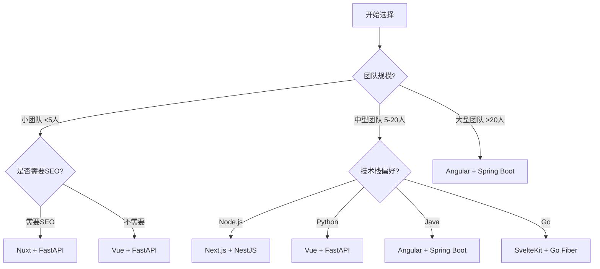

# 架构组合指南

HaloLight 的核心优势在于**前后端完全解耦**，支持任意组合。本文档帮助你选择最适合的技术栈组合。

## 🎯 快速决策流程图



## 📊 组合评分矩阵

根据不同维度为主流组合打分 (满分 ⭐⭐⭐⭐⭐)：

### Next.js + NestJS

| 维度 | 评分 | 说明 |
|------|------|------|
| 开发效率 | ⭐⭐⭐⭐⭐ | TypeScript 全栈统一，类型共享 |
| 性能 | ⭐⭐⭐⭐ | SSR + 边缘缓存优化 |
| 学习曲线 | ⭐⭐⭐ | 需要理解 React 和 NestJS 架构 |
| 生态成熟度 | ⭐⭐⭐⭐⭐ | npm 生态极其丰富 |
| 部署难度 | ⭐⭐⭐⭐ | Vercel + Railway/Fly.io 一键部署 |
| **总评** | **⭐⭐⭐⭐** | 多租户 SaaS、企业后台首选 |

### Vue + FastAPI

| 维度 | 评分 | 说明 |
|------|------|------|
| 开发效率 | ⭐⭐⭐⭐⭐ | Vue 学习曲线平滑，FastAPI 开发快 |
| 性能 | ⭐⭐⭐⭐ | Vue 3 编译优化，Python 异步高效 |
| 学习曲线 | ⭐⭐⭐⭐⭐ | 两者都相对容易上手 |
| 数据处理 | ⭐⭐⭐⭐⭐ | Python 数据科学生态无敌 |
| 部署难度 | ⭐⭐⭐⭐ | 前端 CDN，后端容器化 |
| **总评** | **⭐⭐⭐⭐⭐** | 数据/AI 驱动应用首选 |

### Angular + Spring Boot

| 维度 | 评分 | 说明 |
|------|------|------|
| 开发效率 | ⭐⭐⭐ | 架构规范严谨，初期投入大 |
| 性能 | ⭐⭐⭐⭐ | 企业级优化成熟 |
| 学习曲线 | ⭐⭐ | 两者都有一定复杂度 |
| 企业成熟度 | ⭐⭐⭐⭐⭐ | 大型企业首选技术栈 |
| 长期维护性 | ⭐⭐⭐⭐⭐ | 架构清晰、可维护性强 |
| **总评** | **⭐⭐⭐⭐** | 大型企业、长周期项目首选 |

### SvelteKit + Go Fiber

| 维度 | 评分 | 说明 |
|------|------|------|
| 开发效率 | ⭐⭐⭐⭐ | 代码简洁、开发体验好 |
| 性能 | ⭐⭐⭐⭐⭐ | 两者都是性能标杆 |
| 学习曲线 | ⭐⭐⭐ | Svelte 独特语法，Go 需要学习 |
| 资源占用 | ⭐⭐⭐⭐⭐ | 内存和 CPU 占用都极低 |
| 部署难度 | ⭐⭐⭐⭐⭐ | 容器镜像极小，适合边缘部署 |
| **总评** | **⭐⭐⭐⭐⭐** | 高性能实时应用首选 |

## 💡 组合选择建议

### 按团队规模

#### 小团队 (< 5 人)
- **Vue + FastAPI** - 快速上手、开发效率高
- **Preact + Bun** - 轻量级、性能好
- **Astro + Node.js** - 内容为主的场景

#### 中型团队 (5-20 人)
- **Next.js + NestJS** - TypeScript 统一栈
- **Vue + Spring Boot** - 平衡易用性和企业特性
- **SvelteKit + FastAPI** - 性能与效率兼顾

#### 大型团队 (> 20 人)
- **Angular + Spring Boot** - 架构规范、可维护性强
- **Next.js + NestJS + tRPC BFF** - 微前端 + BFF 架构
- **任意前端 + GraphQL Gateway + 微服务集群**

### 按技术栈偏好

#### TypeScript 全栈
- Next.js / Nuxt / Remix + NestJS + tRPC BFF
- Solid.js / Qwik + Bun + Hono

#### Python 生态
- Vue / React / Astro + FastAPI
- SvelteKit + FastAPI

#### Java 生态
- Angular / Vue + Spring Boot

#### Go 生态
- SvelteKit / Solid / Qwik + Go Fiber

### 按部署环境

#### Serverless / 边缘优先
- Next.js + NestJS（Vercel + Vercel Functions）
- Nuxt + Bun（Cloudflare Workers）
- Astro + Deno Deploy

#### 传统服务器
- 任意前端 (Nginx 静态托管)+ 任意后端 (PM2/Systemd)

#### 容器化 (Kubernetes)
- 任意组合 (Docker 镜像 + K8s Deployment)

#### 混合云
- 前端 (CDN)+ 后端 (私有云)+ tRPC BFF (边缘节点)

## 🔀 迁移与切换

### 前端框架迁移

如果你想从 Vue 迁移到 Angular：

1. **接口不变**：后端 API 契约保持不变
2. **数据兼容**：Mock 数据结构相同
3. **UI 一致**：shadcn/ui 设计语言一致
4. **权限同步**：RBAC 权限配置通用

**迁移成本**：主要是组件语法转换 (Vue → Angular)，业务逻辑可直接复用。

### 后端 API 切换

如果你想从 NestJS 切换到 FastAPI：

1. **OpenAPI 规范**：接口定义保持一致
2. **数据模型**：数据库 schema 相同 (Prisma/SQLAlchemy)
3. **认证机制**：JWT 双令牌机制统一
4. **权限系统**：RBAC 通配符规则相同

**迁移成本**：重写服务层逻辑 (TS → Python)，接口层面完全兼容。

## 🎨 组合矩阵

下表展示所有前端与后端的组合，每个单元格代表可选的技术搭配。

### 前端框架 (横向) × 后端 API (纵向)

| 前端 \ 后端 | NestJS | Node.js | FastAPI | Spring Boot | Go | PHP | Bun | tRPC BFF |
|-------------|--------|---------|---------|-------------|----|-----|-----|----------|
| **Next.js** | ⭐ 最佳 | ✅ | ✅ | ✅ | ✅ | ✅ | ⭐ 最佳 | ⭐ 最佳 |
| **Nuxt** | ✅ | ✅ | ✅ | ✅ | ✅ | ✅ | ✅ | ⭐ 最佳 |
| **Vue** | ✅ | ✅ | ⭐ 最佳 | ✅ | ✅ | ✅ | ✅ | ✅ |
| **Angular** | ✅ | ✅ | ✅ | ⭐ 最佳 | ⭐ 最佳 | ✅ | ✅ | ✅ |
| **SvelteKit** | ✅ | ✅ | ✅ | ✅ | ⭐ 最佳 | ✅ | ✅ | ✅ |
| **Astro** | ✅ | ✅ | ⭐ 最佳 | ✅ | ✅ | ✅ | ✅ | ✅ |
| **Solid.js** | ✅ | ✅ | ✅ | ✅ | ⭐ 最佳 | ✅ | ⭐ 最佳 | ✅ |
| **Qwik** | ✅ | ✅ | ✅ | ✅ | ⭐ 最佳 | ✅ | ⭐ 最佳 | ✅ |
| **Remix** | ⭐ 最佳 | ⭐ 最佳 | ✅ | ✅ | ✅ | ✅ | ⭐ 最佳 | ⭐ 最佳 |
| **Preact** | ✅ | ✅ | ✅ | ✅ | ⭐ 最佳 | ✅ | ⭐ 最佳 | ✅ |
| **Lit** | ✅ | ✅ | ✅ | ✅ | ✅ | ⭐ 最佳 | ✅ | ✅ |
| **Fresh** | ✅ | ✅ | ✅ | ✅ | ⭐ 最佳 | ✅ | ⭐ 最佳 | ✅ |

**图例**：
- ⭐ 最佳：在特定场景下有显著优势
- ✅ 可用：完全兼容，可直接使用

## 🔧 技术栈对比

### 前端框架特性

| 特性 | Next.js | Vue | Angular | SvelteKit | Solid | Qwik |
|------|---------|-----|---------|-----------|-------|------|
| **学习曲线** | 中 | 低 | 高 | 低 | 中 | 中 |
| **TypeScript** | ⭐⭐⭐ | ⭐⭐⭐ | ⭐⭐⭐⭐⭐ | ⭐⭐⭐ | ⭐⭐⭐⭐ | ⭐⭐⭐⭐ |
| **SSR/SSG** | ⭐⭐⭐⭐⭐ | ⭐⭐⭐ | ⭐⭐⭐ | ⭐⭐⭐⭐⭐ | ⭐⭐⭐ | ⭐⭐⭐⭐⭐ |
| **性能** | ⭐⭐⭐⭐ | ⭐⭐⭐⭐ | ⭐⭐⭐ | ⭐⭐⭐⭐⭐ | ⭐⭐⭐⭐⭐ | ⭐⭐⭐⭐⭐ |
| **生态** | ⭐⭐⭐⭐⭐ | ⭐⭐⭐⭐⭐ | ⭐⭐⭐⭐⭐ | ⭐⭐⭐⭐ | ⭐⭐⭐ | ⭐⭐⭐ |
| **包体积** | 中 | 小 | 大 | 极小 | 极小 | 小 |

### 后端技术特性

| 特性 | NestJS | FastAPI | Spring Boot | Go Fiber |
|------|--------|---------|-------------|----------|
| **开发效率** | ⭐⭐⭐⭐ | ⭐⭐⭐⭐⭐ | ⭐⭐⭐ | ⭐⭐⭐⭐ |
| **性能** | ⭐⭐⭐ | ⭐⭐⭐⭐ | ⭐⭐⭐ | ⭐⭐⭐⭐⭐ |
| **TypeScript** | ⭐⭐⭐⭐⭐ | - | - | - |
| **企业成熟度** | ⭐⭐⭐⭐ | ⭐⭐⭐ | ⭐⭐⭐⭐⭐ | ⭐⭐⭐ |
| **数据科学** | ⭐ | ⭐⭐⭐⭐⭐ | ⭐⭐ | ⭐ |
| **资源占用** | 中 | 小 | 大 | 极小 |

## 🚀 快速上手

选择组合后，按以下步骤启动示例：

### 第一步：启动前端

```bash
# 以 Vue 为例
git clone https://github.com/halolight/halolight-vue.git
cd halolight-vue
pnpm install
pnpm dev
```

### 第二步：启动后端 API

```bash
# 以 FastAPI 为例
git clone https://github.com/halolight/halolight-api-python.git
cd halolight-api-python
pip install -e ".[dev]"
uvicorn app.main:app --reload
```

### 第三步：前端对接后端

```bash
# 前端项目 .env.local
VITE_API_URL=http://localhost:8000/api
VITE_USE_MOCK=false  # 关闭 Mock，使用真实 API
```

---

## 📚 相关文档

- [架构说明](/development/architecture) - 深入了解前后端分离设计
- [API 设计规范](/development/api-patterns) - 接口契约说明
- [认证系统](/development/authentication) - 统一认证机制
- [权限管理](/development/components#权限控制) - RBAC 实现方式